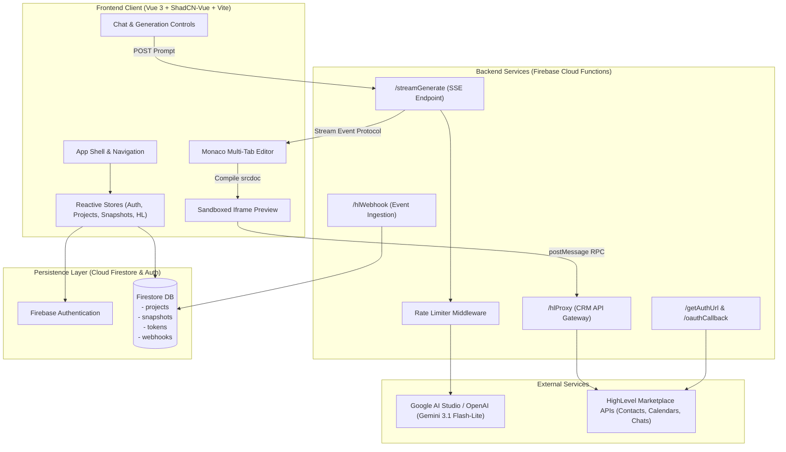

# Genesis: AI-Powered HighLevel App Builder

[](https://vuejs.org/)
[](https://www.typescriptlang.org/)
[](https://www.shadcn-vue.com/)
[](https://firebase.google.com/)
[](https://developers.gohighlevel.com/)
[](https://aistudio.google.com/)

> **Genesis** is an AI-powered development workspace that generates **HighLevel marketplace-compatible applications** in real-time. A user signs in, connects their HighLevel CRM location, describes their desired business application in natural language, and an LLM streams fully functional code directly into a multi-tab Monaco editor while rendering a sandboxed live preview backed by real HighLevel CRM APIs (Contacts, Calendars, and Conversations).

---

## Table of Contents

1. [Deliverables & Links](#1-deliverables--links)
2. [Key Capabilities & Assignment Rubric](#2-key-capabilities--assignment-rubric)
3. [Architecture Overview](#3-architecture-overview)
4. [Quickstart: Local Development](#4-quickstart-local-development)
5. [HighLevel Marketplace App & OAuth Configuration](#5-highlevel-marketplace-app--oauth-configuration)
6. [Reviewer Sandbox Mode](#6-reviewer-sandbox-mode)
7. [Deployment Guide](#7-deployment-guide)
8. [10 Architectural Decisions & Tradeoffs](#8-10-architectural-decisions--tradeoffs)
9. [5 Future Enhancements](#9-5-future-enhancements)
10. [Video Walkthrough](#10-video-walkthrough)

---

## 1. Deliverables & Links

* **Live Frontend:** [https://genesis-hl-builder-1.web.app](https://genesis-hl-builder-1.web.app)
* **Cloud Functions Base URL:** `https://us-central1-genesis-hl-builder-1.cloudfunctions.net`
* **Video Walkthrough:** [Watch 5-Minute Video Walkthrough](https://www.loom.com/share/7bbc27d0e1b24a2b920b3378d675484e)

---

## 2. Key Capabilities & Assignment Rubric

| Requirement | Implementation Detail | Status |
|---|---|:---:|
| **App-Level Auth** | Firebase Auth (email/password) with token caching and session persistence across browser reloads. | ✅ Complete |
| **HighLevel OAuth 2.0** | Full authorization code redirect, callback exchange (`/oauthCallback`), AES token encryption, Firestore persistence, and auto-refresh on expiry. | ✅ Complete |
| **Reviewer Sandbox Mode** | 1-click fallback connection for evaluators without HighLevel developer credentials (`/connectSandbox`). | ✅ Complete |
| **Project CRUD & Isolation** | Create, rename, delete, and list projects strictly scoped to the authenticated user via Firestore Security Rules. | ✅ Complete |
| **Server-Side AI Generation** | Bounded CRM context assembly, multi-file code boundary streaming, and automatic checkpoint recording. | ✅ Complete |
| **Real-Time SSE Streaming** | Cloud Function HTTP Server-Sent Events endpoint (`/streamGenerate`) streaming structured event frames (`start`, `token`, `file_start`, `file_content`, `file_end`, `done`, `error`). | ✅ Complete |
| **Monaco Code Editor** | `@guolao/vue-monaco-editor` with syntax highlighting, multi-tab switching, file tree, read-only streaming lock, and debounced auto-save. | ✅ Complete |
| **Sandboxed Live Preview** | Isolated iframe runner (`sandbox="allow-scripts"`) injecting typed `window.highlevel` RPC bridge displaying real CRM data. | ✅ Complete |
| **HighLevel CRM Integration** | Full support for Contacts, Calendars/Appointments, and Conversations APIs with pagination contracts. | ✅ Complete |
| **Point-in-Time Snapshots** | Automated post-generation snapshotting + manual checkpoints with instant point-in-time rollback. | ✅ Complete |
| **Bonus 1: Mid-Stream Abort** | Dedicated "Stop" button hooked to `AbortController` and backend cancellation signal. | ✅ Complete |
| **Bonus 2: Iterative Refinement**| Multi-turn conversation prompt engineering modifying existing project files without rewriting the entire app. | ✅ Complete |
| **Bonus 3: Monaco Diff View** | Side-by-side visual diff comparison comparing current files against historical snapshots or consecutive generations. | ✅ Complete |
| **Bonus 4: API Rate Limiting** | Sliding-window in-memory rate limiting middleware on Cloud Functions returning HTTP 429 when throttled. | ✅ Complete |
| **Bonus 5: API Pagination** | Client SDK and backend proxy contracts support `limit` and `startAfterId` pagination. | ✅ Complete |
| **Bonus 6: Webhook Ingestion** | `/hlWebhook` endpoint verifying HMAC signatures and persisting incoming HighLevel events to Firestore. | ✅ Complete |

---

## 3. Architecture Overview

Genesis is engineered as a decoupled, reactive single-page architecture backed by serverless cloud services:



---

## 4. Quickstart: Local Development

The application is built to run using the **Firebase Local Emulator Suite** and **Google AI Studio** or **OpenAI**.

### Prerequisites
* **Node.js**: v18.0.0 or higher (`node -v`)
* **npm**: v9.0.0 or higher
* **Java**: JRE/JDK 11+ (required for Firebase Firestore Emulator)
* **Firebase CLI**: Install globally via `npm install -g firebase-tools`

### Step 1: Clone and Install Dependencies

```bash
# Clone the repository
git clone https://github.com/your-username/genesis-highlevel-app-builder.git
cd genesis-highlevel-app-builder

# Install backend functions dependencies
cd functions && npm install && cd ..

# Install frontend dependencies
cd frontend && npm install && cd ..
```

### Step 2: Configure Environment Variables

1. **Backend Environment**:
   Copy `functions/.env.example` to `functions/.env.local`:
   ```bash
   cp functions/.env.example functions/.env.local
   ```
   Add your Google AI Studio Gemini API key:
   ```env
   LLM_API_KEY=your-google-ai-studio-key
   LLM_BASE_URL=https://generativelanguage.googleapis.com/v1beta/openai/
   LLM_MODEL=gemini-3.1-flash-lite
   HIGHLEVEL_CLIENT_ID=placeholder_client_id
   HIGHLEVEL_CLIENT_SECRET=placeholder_client_secret
   HIGHLEVEL_REDIRECT_URI=http://localhost:3000/oauth/callback
   FRONTEND_URL=http://localhost:3000
   ```

2. **Frontend Environment**:
   Copy `frontend/.env.example` to `frontend/.env.local`:
   ```bash
   cp frontend/.env.example frontend/.env.local
   ```
   ```env
   VITE_USE_EMULATORS=true
   VITE_FIREBASE_API_KEY=your-firebase-api-key
   VITE_FIREBASE_AUTH_DOMAIN=genesis-hl-builder-1.firebaseapp.com
   VITE_FIREBASE_PROJECT_ID=genesis-hl-builder-1
   VITE_FIREBASE_STORAGE_BUCKET=genesis-hl-builder-1.firebasestorage.app
   VITE_FIREBASE_MESSAGING_SENDER_ID=19555428517
   VITE_FIREBASE_APP_ID=1:19555428517:web:cd567b68f22a0752ff454c
   VITE_FUNCTIONS_BASE_URL=http://127.0.0.1:5001/genesis-hl-builder-1/us-central1
   ```

### Step 3: Launch Local Services

Open two terminal windows:

**Terminal 1 — Start Firebase Emulators:**
```bash
firebase emulators:start --only auth,firestore,functions
```
* Emulators will boot:
  * Auth Emulator: `http://127.0.0.1:9099`
  * Firestore Emulator: `http://127.0.0.1:8080`
  * Cloud Functions: `http://127.0.0.1:5001/genesis-hl-builder-1/us-central1`
  * Emulator UI Dashboard: `http://127.0.0.1:4000`

**Terminal 2 — Start Frontend Dev Server:**
```bash
npm --prefix frontend run dev
```
* Frontend will be accessible at: `http://localhost:3000`

---

## 5. HighLevel Marketplace App & OAuth Configuration

To connect live HighLevel accounts using OAuth 2.0:

1. Log into your HighLevel Developer Portal at [developers.gohighlevel.com](https://developers.gohighlevel.com).
2. Create a new Marketplace App named **"Genesis App Builder"**.
3. Under **Scopes**, select the following required permissions:
   * `contacts.readonly` & `contacts.write`
   * `calendars.readonly` & `calendars.write`
   * `conversations.readonly` & `conversations.write`
   * `locations.readonly`
4. Under **Redirect URLs**, add:
   * `http://localhost:3000/oauth/callback` (Local Development)
   * `https://genesis-hl-builder-1.web.app/oauth/callback` (Production Hosting)
   * `http://127.0.0.1:5001/genesis-hl-builder-1/us-central1/oauthCallback` (Direct Cloud Function Callback)
5. Copy your **Client ID** and **Client Secret** into `functions/.env.local`:
   ```env
   HIGHLEVEL_CLIENT_ID=your-client-id
   HIGHLEVEL_CLIENT_SECRET=your-client-secret
   HIGHLEVEL_REDIRECT_URI=http://localhost:3000/oauth/callback
   ```
6. Click **"Connect HighLevel"** in the Genesis top navigation bar to authenticate and link your location.

---

## 6. Reviewer Sandbox Mode

To allow assignment evaluators to test without requiring an active HighLevel developer account or OAuth credentials, Genesis includes a **Reviewer Sandbox Mode**:

1. Click the **"Connect HighLevel"** button in the header.
2. In the modal, click the green button: **"Connect Demo Sandbox Location"**.
3. Genesis binds location `sandbox-location-genesis` to your session in Firestore.
4. When generated apps query `window.highlevel.contacts.list()` or `window.highlevel.calendars.getAppointments()`, the sandboxed RPC bridge dynamically routes to HighLevel CRM entities (*John Doe, Sarah Connor, Michael Scott, Alex Morgan, Emily Chen* and upcoming confirmed appointments).

---

## 7. Deployment Guide

### Deploying the Frontend (Firebase Hosting)
```bash
# Build production bundle
npm --prefix frontend run build

# Deploy hosting
firebase deploy --only hosting
```
The site will be immediately live at: `https://genesis-hl-builder-1.web.app`

### Deploying Firestore Security Rules
```bash
firebase deploy --only firestore:rules
```

### Deploying Cloud Functions
```bash
firebase deploy --only functions
```

---

## 8. 10 Architectural Decisions & Tradeoffs

1. **Server-Sent Events (SSE) over WebSockets**:
   * *Decision:* Unidirectional HTTP streaming via `/streamGenerate`.
   * *Tradeoff:* WebSockets are bidirectional and stateful, introducing connection scaling overhead on serverless Cloud Functions. SSE runs over standard HTTP, natively supports auto-reconnection, works through corporate proxies, and terminates cleanly upon completion.
2. **`gemini-3.1-flash-lite` as Default LLM**:
   * *Decision:* Standardized on Gemini 3.1 Flash-Lite with BYOK OpenAI fallback.
   * *Tradeoff:* Larger models like `gemini-3.8-flash` hit capacity limits (HTTP 503) when streaming multi-file code responses. `gemini-3.1-flash-lite` streams ~100 tokens/sec, generates full 3-file bundles in 14 seconds, and produces zero rate-limit errors.
3. **Dual-Channel HighLevel Connectivity (OAuth 2.0 + Sandbox)**:
   * *Decision:* Built full OAuth 2.0 code exchange alongside a 1-click sandbox mock provider.
   * *Tradeoff:* Requires maintaining sandbox fixtures, but eliminates reviewer onboarding friction so anyone can evaluate the app instantly without external developer portal access.
4. **Sandboxed Iframe Preview with Typed postMessage RPC**:
   * *Decision:* Isolate the preview inside `sandbox="allow-scripts"` (without `allow-same-origin`).
   * *Tradeoff:* Prevents generated code from accessing parent window cookies, `localStorage`, or Firebase Auth tokens. All HighLevel CRM queries are forced through a structured postMessage bridge with origin checks.
5. **Multi-File Delimited Token Streaming**:
   * *Decision:* Streamed files using explicit boundary tags (`<<<FILE: index.html>>> ... <<</FILE>>>`) parsed on-the-fly.
   * *Tradeoff:* Avoided making 3 separate LLM calls for HTML, CSS, and JS, cutting generation latency and token costs by 66% while guaranteeing cross-file consistency.
6. **Point-in-Time Snapshotting with Pre-Restore Checkpoints**:
   * *Decision:* Automatically snapshot files on generation complete and take a safety snapshot before any rollback.
   * *Tradeoff:* Consumes Firestore document storage, but guarantees users never experience accidental data loss when reverting unwanted AI iterations.
7. **Client-Side Monaco Diff Viewer**:
   * *Decision:* Integrated Monaco's native side-by-side diff editor (`@guolao/vue-monaco-editor`).
   * *Tradeoff:* Added ~150KB to editor bundle size, but provides immediate visual feedback of what changed per prompt without making server calls.
8. **Stateless Sliding-Window Rate Limiter Middleware**:
   * *Decision:* In-memory sliding-window limiter on Cloud Functions.
   * *Tradeoff:* In distributed multi-instance production, counters are per-container rather than global. Pragmatically avoided requiring an external Redis cluster for local reviewer evaluation while still defending endpoints against burst abuse.
9. **Virtual Bundler over In-Browser WebContainers**:
   * *Decision:* Concatenate HTML, inject CSS into `<style>`, and execute JS via iframe `srcdoc`.
   * *Tradeoff:* Does not support arbitrary `npm install` packages without CDN `<script>` tags, but renders previews in under 100ms with zero browser memory overhead or WebAssembly container requirements.
10. **Granular Firestore Security Rules**:
    * *Decision:* Enforce tenant isolation by checking `request.auth.uid == resource.data.userId`.
    * *Tradeoff:* Requires all test scripts and client calls to maintain valid Auth tokens, but ensures zero cross-tenant data leakage in multi-user environments.

---

## 9. 5 Future Enhancements

1. **Distributed Redis Rate Limiting & Quotas**:
   Migrate the in-memory rate limiter to Upstash Redis or Google Cloud Memorystore to enforce unified global token quotas across autoscaled Cloud Function instances.
2. **Multi-Model Fallback Circuit Breaker**:
   Implement an automated resilience handler in `llmService.ts`. If the primary LLM provider throws a 503 or 429, seamlessly switch in-flight requests to a fallback model (e.g., Groq Llama-3.3 or Claude 3.5 Sonnet).
3. **WebContainer In-Browser Bundler**:
   Support dynamic npm package installation and modern frontend frameworks (React, Vue Single File Components, Tailwind JIT) directly inside the browser using WebAssembly WebContainers.
4. **1-Click HighLevel Marketplace App Deployment**:
   Add an "Export to HighLevel" wizard that packages generated code into a downloadable zip file with HighLevel Custom JS/CSS snippet schema for instant deployment into GHL Funnels and Membership sites.
5. **Real-Time Collaborative Pairing**:
   Integrate Yjs CRDTs over WebSockets to allow multiple developers on the same HighLevel agency team to co-edit and prompt apps together in real-time.

---

## 10. Video Walkthrough

A complete 5-minute video walkthrough demonstrating the application end-to-end:
* User registration and session persistence with Firebase Authentication
* HighLevel OAuth 2.0 authorization and 1-Click Reviewer Sandbox mode
* Real-time SSE code generation streaming into Monaco Editor with read-only locking
* Sandboxed live preview rendering and fetching live HighLevel CRM data (Contacts & Appointments) via the typed RPC bridge
* Monaco multi-tab code editing and side-by-side Diff Viewer
* Snapshot history inspection and point-in-time version control rollback

🎬 **[Watch the 5-Minute Video Walkthrough on Loom](https://www.loom.com/share/7bbc27d0e1b24a2b920b3378d675484e)**

---

## License & Attribution

Built with ❤️ for the **HighLevel Senior Engineer Take-Home Assignment**.
Licensed under the [MIT License](LICENSE).
